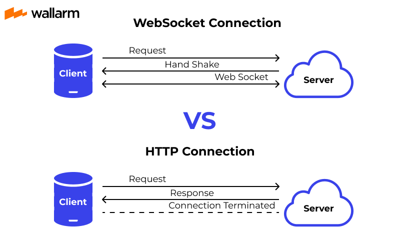

# WebSockets

<https://developer.mozilla.org/es/docs/Web/API/WebSocket>

# WebSocket vs HTTP





# Librería para trabajar con Web Sockets

<https://socket.io/>

<https://socket.io/docs/v4/tutorial/step-3>

```sh
npm install socket.io
```